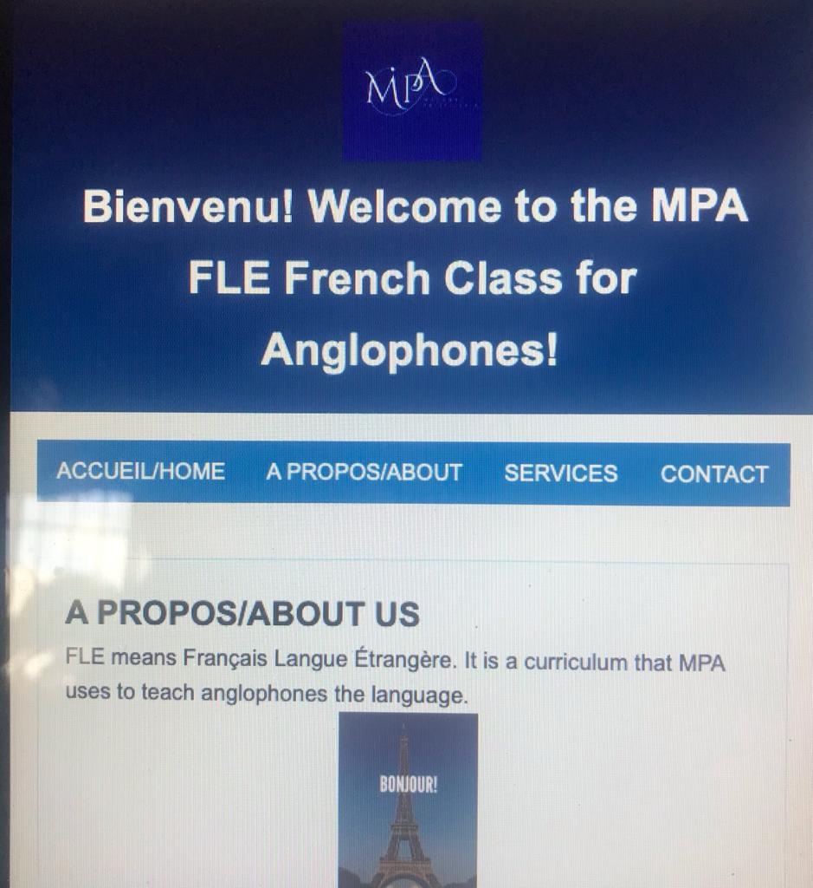

**MPA FLE French Class**

This website is designed to assist Anglophone speakers in their journey to learn French. It serves as an ALX Portfolio Project.

**Installation:**
To access this website, simply click on the link to the deployed site: [MPA FLE French Class](file:///Users/priscilla/MPA-SE/index.html).

**Usage:**
The website is user-friendly and responsive, making it accessible on both desktop and mobile devices. It provides resources and materials to aid in the learning of the French language.

**Contributing:**
If you're interested in contributing to the improvement of this project, please reach out to the project owner, Priscilla Momodu, through her LinkedIn profile: [LinkedIn Profile](https://www.linkedin.com/posts/momodu-priscilla_my-alx-portfolio-project-this-project-offers-activity-7110249328006356992-5h3i?utm_source=share&utm_medium=member_ios). Collaborators and contributions are welcome to enhance the learning experience.

**Related Projects:**
In the creation of this project,other ALX Portfolio Projects and educational resources were explored to further expand knowledge and skills.

**Licensing:**
Contact the project owner, Priscilla Momodu, for information on licensing and usage rights.

**More About My Story**:
It was supposed to be a team project, however, I missed the deadline set to choose team members due to factors that were beyond my control. Yet, I chose to not give up on doing it.
I love languages and so I could think of nothing else but a project focused on languages; especially the French language😁. 
For the Frontend I chose to use HTML5, CSS3 and JavaScript without any additional frameworks. I did not use anything more because I dedicated my time to solidifying my understanding of these three, as I built the project. 
The website is responsive and compatible with mobile.
In the beginning, I was confused. I really did not know where to start. Thank God for “Trello”! It helped me define my steps. Then, for the how to, I did some research online. And I learnt a lot and I still am learning a lot from freeCodeCamp!
Let me share some of what I’ve learned. HTML is the structure of web design and CSS is the style. What would I have done differently? I would ensure I don’t miss deadlines😭 What kind of engineer am I? I am the kind who started excited, had some fears along the way, faced tasks even though I was afraid and is learning to do hard things. I am so in love with Frontend now😍 Now I know why a lot of engineers are Frontend developers.
My name is Priscilla. I am an ALX student: cohort 11. 
